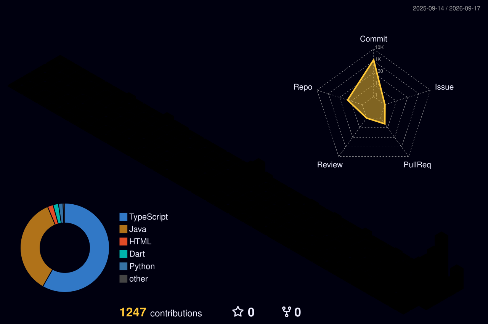

<div align="center">


<a href="https://git.io/typing-svg">
  
</a>

<br/>


</div>

---

## 👨‍💻 About Me

I'm **Vikas**, a developer focused on building practical products that combine **AI, automation, full-stack engineering, computer vision, mobile development, and modern software architecture**.

I enjoy taking ideas from concept to working product — designing the experience, building the backend, integrating intelligent features, and getting the final system ready for real users.

- 🤖 Building AI-powered applications and intelligent workflows
- 🌐 Developing modern full-stack products
- 👁️ Exploring computer vision and real-world detection systems
- 📱 Building mobile experiences and connected applications
- 🏫 Creating ERP, education, and management platforms
- 🚀 Always improving products through iteration, testing, and better UX

---

## 🧰 Tech Arsenal

<div align="center">


</div>

<br/>

<div align="center">


</div>

---

## 🚀 Featured Projects

<div align="center">

<a href="https://github.com/vikas9391/Aero-Sense">
  
</a>
<a href="https://github.com/vikas9391/EduSphere-ERP-College-Management-System">
  
</a>

<a href="https://github.com/vikas9391/AI-recruitment-agent">
  
</a>
<a href="https://github.com/vikas9391/Sign-Language-Detection">
  
</a>

<a href="https://github.com/vikas9391/Sahaaya-ai">
  
</a>
<a href="https://github.com/vikas9391/StudyForge">
  
</a>

</div>

---

## 📊 Developer Dashboard

<div align="center">


<br/>


</div>

---

## 🧊 3D Contribution Universe

<div align="center">



</div>

> This 3D contribution graph is generated automatically by GitHub Actions and refreshed every day.

---

## 🧠 What I'm Focused On

```text
AI Systems          ███████████████████░   Building intelligent applications
Full-Stack          ████████████████████   Shipping complete products
Computer Vision     █████████████████░░░   Exploring visual intelligence
Mobile Development  ████████████████░░░░   Creating connected experiences
Product Engineering ███████████████████░   Improving architecture + UX
```

---

## 🌟 More Projects

| Project | Focus |
|:--|:--|
| ✈️ **[Aero-Sense](https://github.com/vikas9391/Aero-Sense)** | Intelligent aviation / aerospace platform |
| 🏫 **[EduSphere ERP](https://github.com/vikas9391/EduSphere-ERP-College-Management-System)** | College management and ERP system |
| 🤖 **[AI Recruitment Agent](https://github.com/vikas9391/AI-recruitment-agent)** | AI-powered recruitment workflow |
| 🧠 **[Sahaaya AI](https://github.com/vikas9391/Sahaaya-ai)** | AI assistance platform |
| 🤟 **[Sign Language Detection](https://github.com/vikas9391/Sign-Language-Detection)** | Computer-vision sign language detection |
| 🎓 **[StudyForge](https://github.com/vikas9391/StudyForge)** | Education-focused software |
| 💡 **[Eunoia](https://github.com/vikas9391/Eunoia)** | Full-stack product project |
| 🌍 **[Halal Trails Umrah](https://github.com/vikas9391/halal-trails-umrah)** | Travel and registration platform |

---

## 🤝 Let's Connect

<div align="center">

<a href="https://github.com/vikas9391">
  
</a>
<a href="mailto:vikas93912@gmail.com">
  
</a>

<br/><br/>

### `Build • Learn • Improve • Repeat`


</div>
