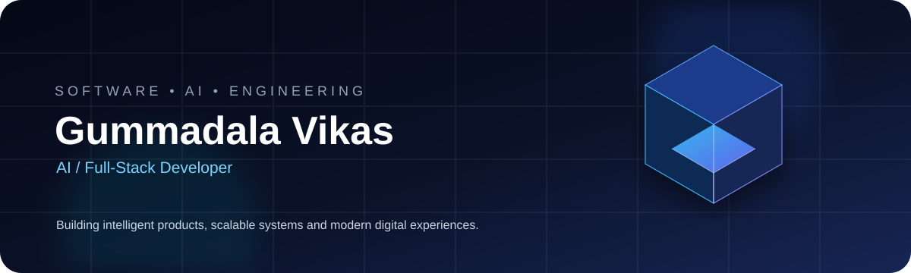
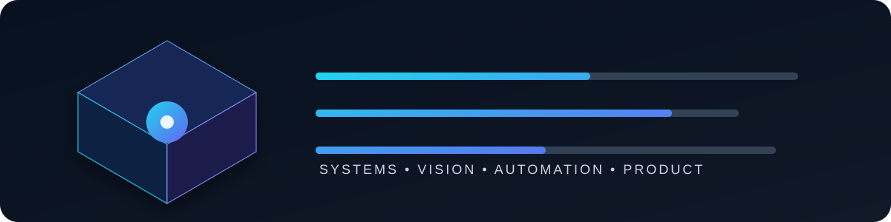

 

  

&nbsp;

---

## About

I am **Gummadala Vikas**, a software developer focused on building practical products across **artificial intelligence, full-stack engineering, computer vision, mobile applications, automation, and enterprise systems**.

My approach is product-oriented: understand the problem, design the experience, engineer the system, integrate intelligent capabilities, and continuously improve the result.

**Primary areas**

- Artificial intelligence and intelligent application workflows
- Full-stack web application engineering
- Computer vision and visual intelligence
- Android and mobile application development
- ERP, education, and management platforms
- Product architecture, automation, and deployment

---

## Technology

  

---

## Selected Work

---

## Engineering Dashboard

 

---

## 3D Contribution Profile

The contribution visualization is generated automatically through GitHub Actions and refreshed on a daily schedule.

---

## Development Focus

| Area | Direction |
|:--|:--|
| AI Systems | Intelligent applications, agents, automation |
| Full-Stack | End-to-end product development |
| Computer Vision | Detection, recognition, visual interfaces |
| Mobile | Modern Android and connected experiences |
| Enterprise | ERP and management platforms |
| Product Engineering | Architecture, UX, reliability, deployment |

---

## More Work

| Project | Focus |
|:--|:--|
| [Aero-Sense](https://github.com/vikas9391/Aero-Sense) | Aviation and aerospace-focused software |
| [EduSphere ERP](https://github.com/vikas9391/EduSphere-ERP-College-Management-System) | College management and ERP |
| [AI Recruitment Agent](https://github.com/vikas9391/AI-recruitment-agent) | AI-assisted recruitment workflow |
| [Sahaaya AI](https://github.com/vikas9391/Sahaaya-ai) | AI assistance platform |
| [Sign Language Detection](https://github.com/vikas9391/Sign-Language-Detection) | Computer-vision based recognition |
| [StudyForge](https://github.com/vikas9391/StudyForge) | Education-focused software |
| [Eunoia](https://github.com/vikas9391/Eunoia) | Full-stack application |
| [Halal Trails Umrah](https://github.com/vikas9391/halal-trails-umrah) | Travel and registration platform |

---

## Connect

  

Build with intent. Engineer with discipline. Improve continuously.

